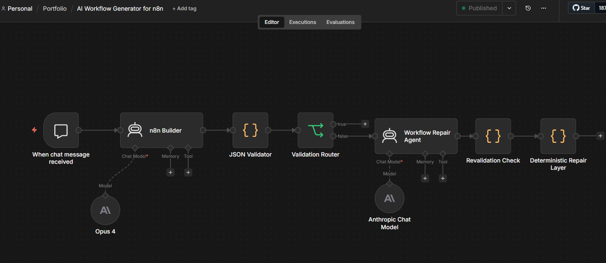
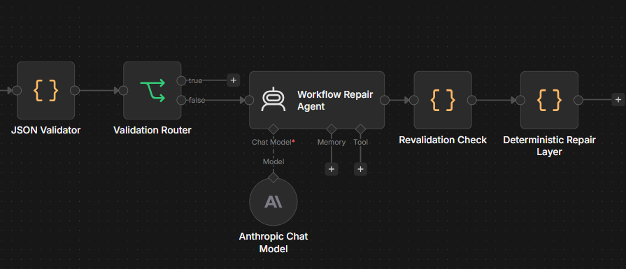
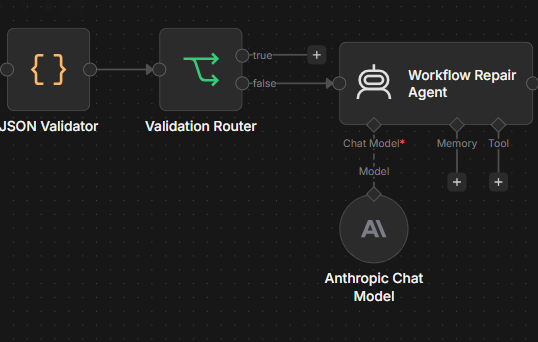
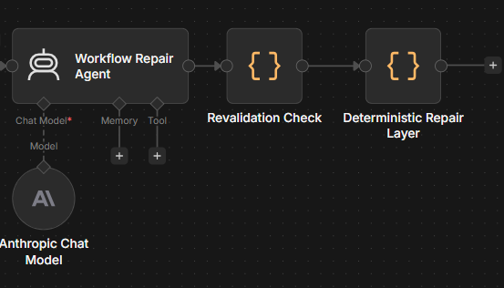
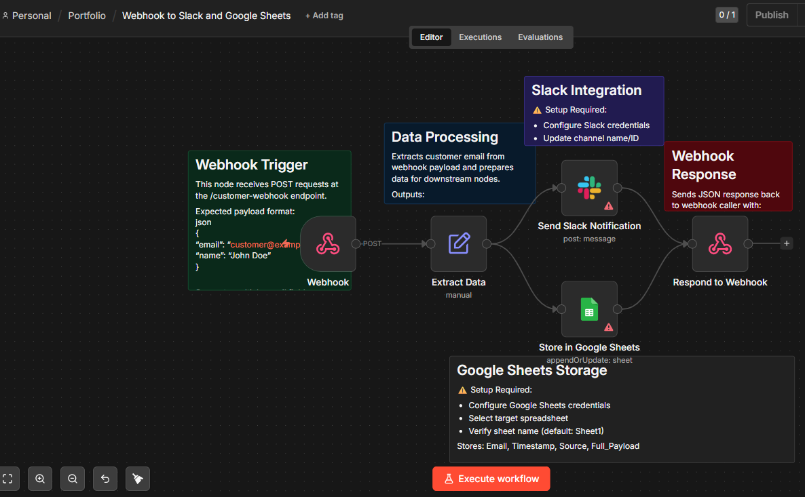
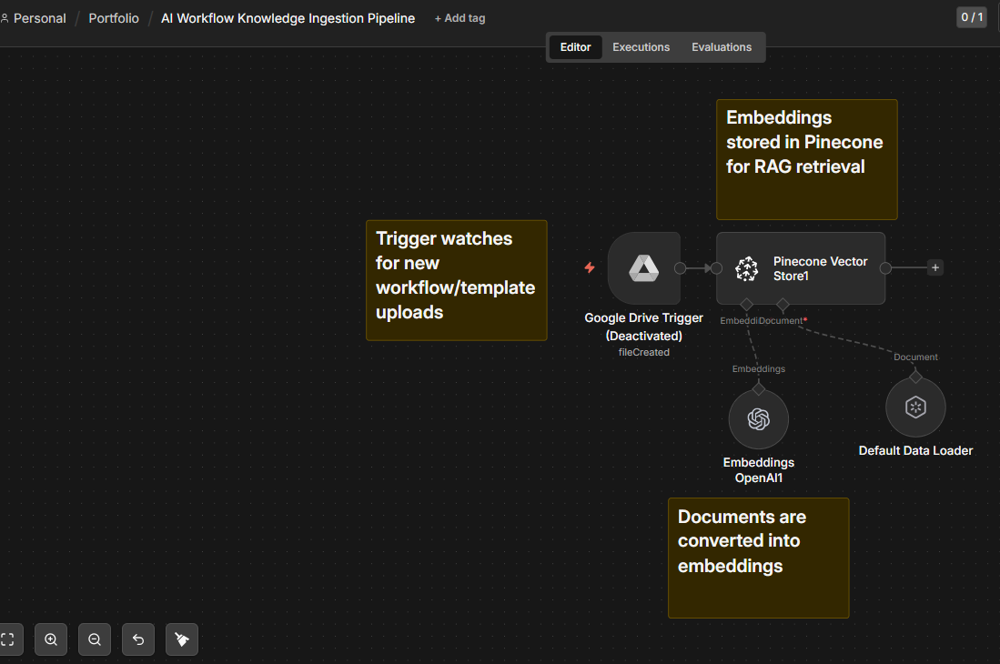

# AI Workflow Generator for n8n

## Overview

AI Workflow Generator for n8n is a self-healing AI automation system that generates importable n8n workflows from natural language requests.

The project combines:

* LLM-powered workflow generation
* Deterministic JSON validation
* Conditional repair orchestration
* Recursive revalidation
* Deterministic repair layers
* RAG-based workflow ingestion pipelines

The system was designed to solve a real problem encountered when generating n8n workflows with LLMs:

LLM-generated workflows frequently contain malformed JSON, invalid escaping, broken expressions, or non-importable structures.

This project introduces a validation and repair architecture that attempts to automatically detect and repair those failures before the workflow reaches the final user.

---

# Architecture



The platform is divided into two modular workflows:

1. AI Workflow Generator for n8n
2. Workflow Knowledge Ingestion Pipeline

This separation improves maintainability, scalability, and architectural clarity.

---

# Main Features

## AI Workflow Generation

Natural language requests are converted into structured importable n8n workflows using Anthropic Claude.

Example request:

```text
Create an n8n workflow that receives a webhook, extracts a customer email from the payload, sends a Slack notification, and stores the data in Google Sheets.
```

The system generates:

* nodes
* connections
* settings
* sticky notes
* validation-safe expressions
* importable workflow JSON

---

## Self-Healing Validation Architecture



The system validates generated workflows before considering them complete.

Validation stages include:

* JSON syntax validation
* required field validation
* semantic workflow validation
* malformed expression detection
* responseBody escaping validation

If validation fails:

1. The workflow is routed into a repair pipeline
2. The repair agent attempts correction
3. The repaired workflow is revalidated
4. Deterministic repair logic is applied if needed

This creates a hybrid AI + deterministic correction system.

---

## Validation Router



The Validation Router determines whether generated workflows:

* pass validation immediately
* or require repair orchestration

This creates conditional execution behavior similar to production AI orchestration systems.

---

## Repair Pipeline



The repair system contains:

* AI repair orchestration
* recursive validation
* deterministic field repair
* safe JSON correction logic

The deterministic repair layer specifically targets malformed workflow expressions that are commonly produced by LLMs.

---

## Generated Workflow Example



The repository includes a fully generated and importable example workflow:

* Webhook trigger
* Slack notification
* Google Sheets storage
* JSON webhook response
* Documentation sticky notes

This demonstrates the end-to-end generation pipeline.

---

## Workflow Knowledge Ingestion Pipeline



The ingestion workflow provides retrieval augmentation support.

Pipeline:

1. Google Drive watches for uploaded workflow templates
2. Documents are loaded and processed
3. OpenAI embeddings are generated
4. Embeddings are stored in Pinecone
5. The vector database becomes searchable workflow context

This enables future RAG expansion for:

* workflow examples
* reusable templates
* node configuration retrieval
* semantic workflow assistance

---

# Repository Structure

```text
AI-Workflow-Generator-for-n8n/
│
├── README.md
├── LICENSE
├── .gitignore
│
├── workflows/
│   ├── ai-workflow-generator.json
│   ├── workflow-knowledge-ingestion.json
│   └── generated-webhook-slack-sheets-example.json
│
├── screenshots/
│   ├── hero-workflow-overview.png
│   ├── self-healing-architecture.png
│   ├── validation-router.png
│   ├── repair-pipeline.png
│   ├── successful-generated-workflow.png
│   └── ingestion-pipeline.png

```

---

# Technologies Used

## Core Platform

* n8n
* Anthropic Claude
* OpenAI Embeddings
* Pinecone

## Concepts

* AI Agents
* RAG Pipelines
* Validation Systems
* Self-Healing Architectures
* Workflow Automation
* Deterministic Repair Layers
* Prompt Engineering
* JSON Validation

---

# Example Payload

File:

```text
examples/customer-webhook-payload.json
```

```json
{
  "email": "customer@example.com",
  "name": "John Doe"
}
```

---

# Importing the Workflows

1. Open n8n
2. Go to Workflows
3. Click Import from File
4. Select any workflow JSON file from the workflows/ directory
5. Configure credentials
6. Save and activate the workflow

---

# Required Credentials

Depending on the workflow used, configure:

* Anthropic API
* OpenAI API
* Pinecone API
* Google Drive OAuth2
* Google Sheets OAuth2
* Slack API

All exported workflows were sanitized for public release.

No real credentials, IDs, webhook identifiers, or production metadata are included.

---

# Engineering Highlights

This project demonstrates:

* AI orchestration systems
* multi-stage validation pipelines
* recursive repair loops
* deterministic AI guardrails
* hybrid AI + rules-based correction
* modular RAG architecture
* production-style workflow engineering

---

# Future Improvements

Potential future enhancements:

* automatic workflow deployment via n8n API
* multi-agent generation systems
* advanced semantic validation
* node compatibility verification
* workflow simulation before import
* vector search ranking improvements
* workflow analytics dashboards
* multi-model repair orchestration

---

# Author

Boris Villanueva

GitHub:

[https://github.com/borisvillanueva](https://github.com/borisvillanueva)

